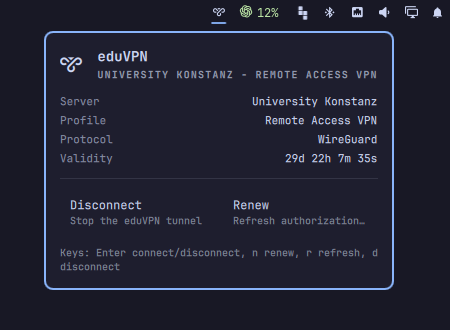

# omarchy-eduvpn

A small Omarchy bar widget for controlling the official `eduvpn-cli` client.
It keeps eduVPN as the owner of authentication and NetworkManager profiles,
while providing the useful daily controls in the bar.

<p align="center">
  
</p>

## Features

- Shows whether the eduVPN tunnel is connected.
- Shows the configured server, profile, protocol, and remaining validity.
- Connects to the single configured eduVPN server.
- Disconnects through `eduvpn-cli`, including its normal cleanup.
- Renews authorization and reconnects with one button.
- Opens a floating terminal when initial setup or a server selection needs input.
- Serializes CLI calls across multiple monitors.

The widget does not import or manage WireGuard files itself. `eduvpn-cli` owns
the complete eduVPN lifecycle, including browser authentication and renewal.

## Requirements

- Omarchy with the Quickshell shell.
- The official `eduvpn-cli` command, normally installed with `python-eduvpn-client`.
- NetworkManager, as required by eduVPN.
- A working browser and Secret Service/keyring for browser authorization.

Install the eduVPN client and CLI through Omarchy's AUR helper:

```bash
omarchy pkg aur add python-eduvpn-client
```

This provides `/usr/bin/eduvpn-cli` and pulls in the required
`python-eduvpn_common` dependency. Verify the installation with:

```bash
eduvpn-cli --version
```

Set up eduVPN once from an interactive terminal if no server is configured:

```bash
eduvpn-cli interactive
```

At the `[eduVPN]:` prompt, enter `connect`. Search for your institution,
select it, and complete the browser authorization. For example, the
University Konstanz server is then saved as a configured server and can be
listed with:

```bash
eduvpn-cli list
```

After setup, connect to the saved server with its number, for example:

```bash
eduvpn-cli connect -n 1
```

## Install

```bash
omarchy plugin add https://github.com/oameye/omarchy-eduvpn.git --enable
```

The widget appears in the right side of the bar. Move it with:

```bash
omarchy bar move oameye.eduvpn --before omarchy.clock
```

To update or remove it:

```bash
omarchy plugin update oameye.eduvpn
omarchy plugin remove oameye.eduvpn
```

## Use

- Left click opens the panel.
- Right click connects or disconnects.
- Middle click refreshes status.
- The panel provides Connect/Disconnect and Renew buttons.
- Keyboard shortcuts are `Enter` for connect/disconnect, `n` for renew, `r` for
  refresh, and `d` for disconnect.

Renewal is always manual. eduVPN renewal can open a browser, so the widget
never renews unexpectedly in the background.

## IPC

The widget exposes these shell IPC commands:

```bash
omarchy-shell oameye.eduvpn status
omarchy-shell oameye.eduvpn connect
omarchy-shell oameye.eduvpn disconnect
omarchy-shell oameye.eduvpn renew
omarchy-shell oameye.eduvpn refresh
omarchy-shell oameye.eduvpn toggle
```

## Derived work

The visual shell and testing approach were derived from
[jkoestinger/omarchy-vpn](https://github.com/jkoestinger/omarchy-vpn), then
reduced to one eduVPN-specific backend. The original project is MIT licensed.

## License

MIT. See [LICENSE](LICENSE).
